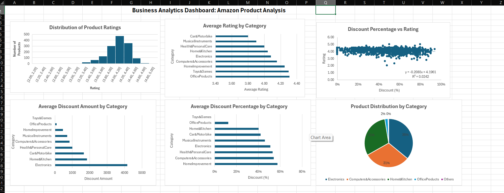
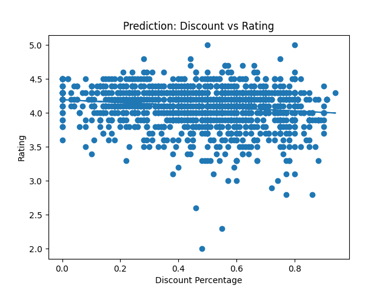
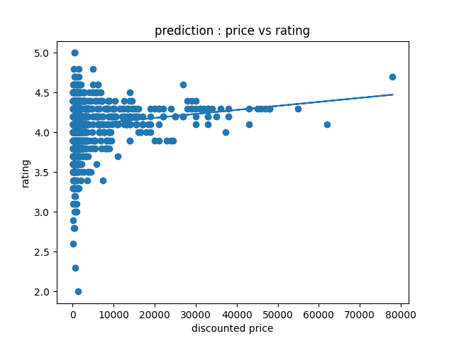

# amazon-pricing-customer-ratings-analysis
Business Decision Making Using Predictive Analytics using Amazon product data, Python, and Excel to analyze pricing strategies, customer ratings, and regression models.
# 📊 Business Decision Making Using Predictive Analytics: An Analysis of Amazon Product Pricing and Customer Ratings

## 📌 Project Overview

This project analyzes Amazon product data using Microsoft Excel and Python to understand pricing strategies, customer ratings, and predictive analytics.

---

## 🎯 Objectives

- Analyze customer ratings across product categories.
- Study pricing and discount strategies.
- Validate pricing data.
- Build predictive models.
- Generate business insights.

---

## 🛠️ Tools & Technologies

- Microsoft Excel
- Python
- Pandas
- Matplotlib
- Scikit-learn

---

## 📂 Dataset

- **Source:** Kaggle – Amazon Product Dataset
- **File Used:** `Amazon_sales_data.xlsm`

---

# 📈 Excel Dashboard

The dashboard summarizes the key insights obtained from descriptive analysis.

## Dashboard Preview



---

# 📉 Python Regression Results

## 1️⃣ Discount Percentage vs Rating

This graph shows the relationship between discount percentage and customer ratings.



## 2️⃣ Price vs Rating

This graph illustrates the relationship between discounted price and customer ratings.



---

# 🤖 Python Analysis

The Python script performs:

- Data validation
- Pricing anomaly detection
- Simple Linear Regression
- Multiple Linear Regression

---

# 📊 Key Results

- **926 pricing mismatches** detected.
- **Average absolute difference:** ₹11.36
- **Maximum difference:** ₹354.00
- Developed **three regression models**.

## Key Findings

- Most products have ratings between **3.5 and 4.5**.
- Discount percentage has a **weak relationship** with ratings.
- Product price has **minimal impact** on customer ratings.
- Customer satisfaction is likely influenced more by product quality and user experience than by pricing alone.

---

# 📁 Repository Files

- `analysis.py`
- `Amazon_sales_data.xlsm`
- `Dashboard.png`
- `prediction_plot.png`
- `price_vs_rating.png`

---

# ▶️ How to Run

```bash
pip install pandas matplotlib scikit-learn openpyxl
python analysis.py
```

---

# 👨‍💻 Author

**Madugula Karthik**  
BBA (Business Analytics)  
Aspiring Data Analyst
